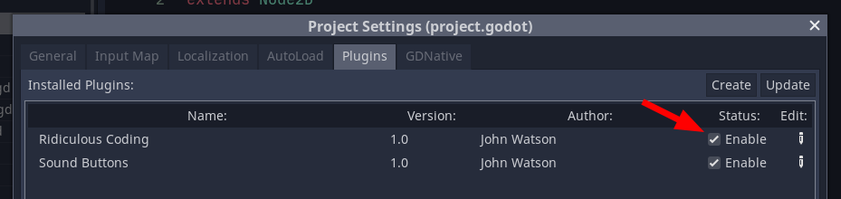

# ridiculous_coding for Godot

Written by John Watson

## What does it do?

It makes your coding experience in Godot 1000x more ridiculous.


This addon was inspired by [Textreme2 by Ash K](https://ash-k.itch.io/textreme-2). Go buy it!

## Installation

1. Create an `addons` directory in your Godot project
2. Create a `ridiculous_coding` directory inside `addons`
3. Copy all of the files there
4. Enable the plugin in `Project Settings | Plugins`
5. **IMPORTANT:** Choose a *monospaced* Code Font in `Editor Settings` on the `Interface | Editor` tab otherwise the addon won't be able to calculate your cursor position correctly

You might need to close and open your editor or open a new script file to start seeing anything working. I don't know why. Pull requests welcome.

Your Godot directory structure should look like this:

```
res://
    addons
        ridiculous_coding
            ...all the ridiculous coding files...
```




## About me

Hey, I'm John and I'm making a game in Godot called [Gravity Ace](https://gravityace.com).

Come follow me on [Twitter](https://twitter.com/yafd) and [wishlist the game on Steam](https://store.steampowered.com/app/1003860/Gravity_Ace/) and [itch.io](https://jotson.itch.io/gravity)!